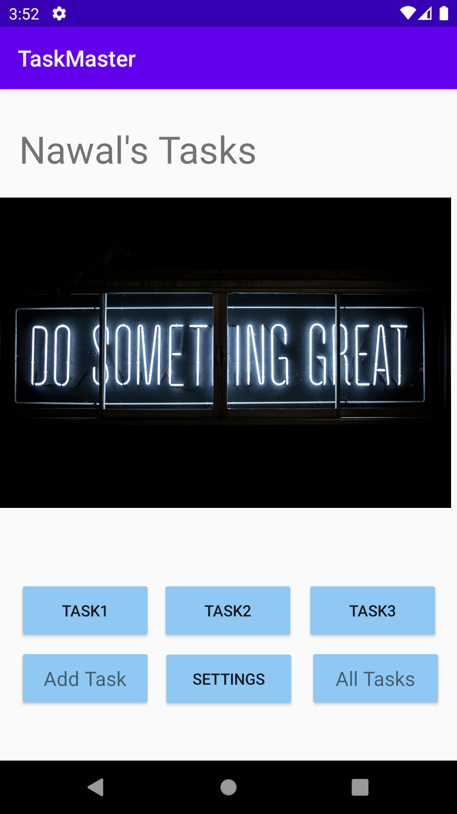
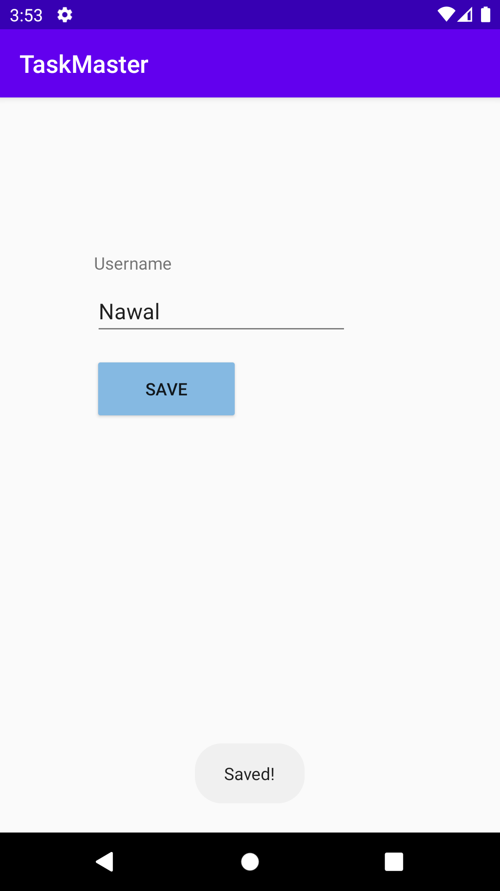
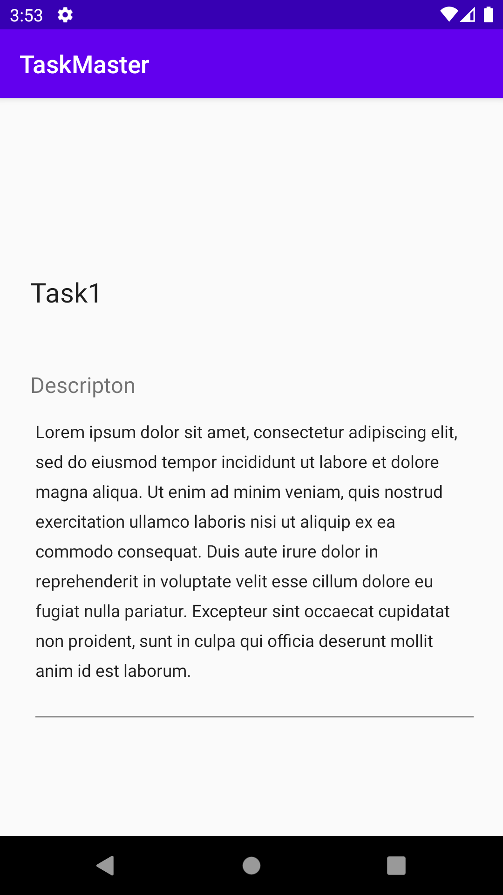
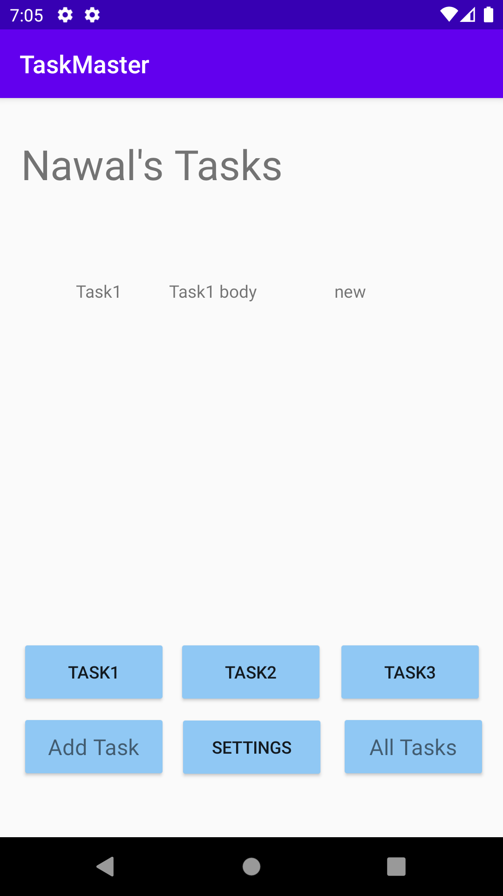

# Task Master

## Lab26

An android application which allows users to manage their tasks . version: 1.0.0

- create a home page has an image and two buttons (add task , all tasks) to redirect to other activities.

- create an add task page has two text plain (title , descreption) and an add buttons shows a message of submitted.

- create all tasks page has an image and a back button redirect you back to the home page.

## Home Page

## Add Task Page

## All Tasks Page

## Lab27

- task details page which shows the task title and the descreption.

- a setting page which the user can change his username from there.

## Home Page

## Settings Page

## Task Detail Page

## Lab28

create a recycler view to show 3 harcoded tasks.

## Home Page

## Lab29
add data base to store data inside.
when adding a new task from add task page the task will be stored in the data base.
