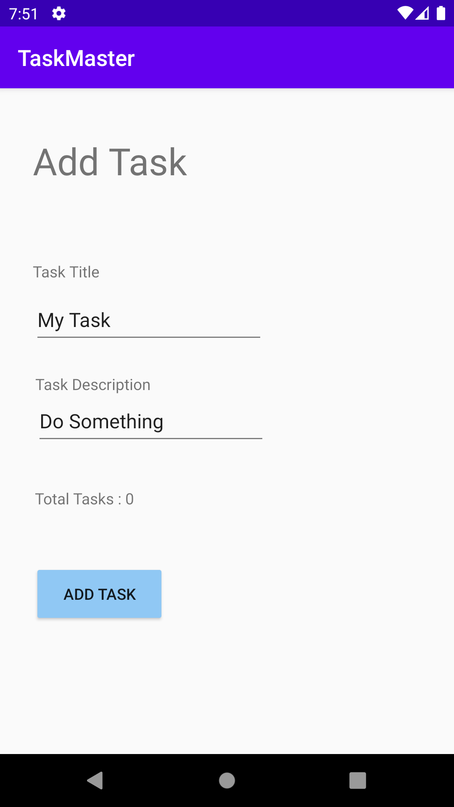

# Task Master

An android application which allows users to manage their tasks . version: 1.0.0

- create a home page has an image and two buttons (add task , all tasks) to redirect to other activities.

- create an add task page has two text plain (title , descreption) and an add buttons shows a message of submitted.

- create all tasks page has an image and a back button redirect you back to the home page.

## Home Page

## Add Task Page

## All Tasks Page
